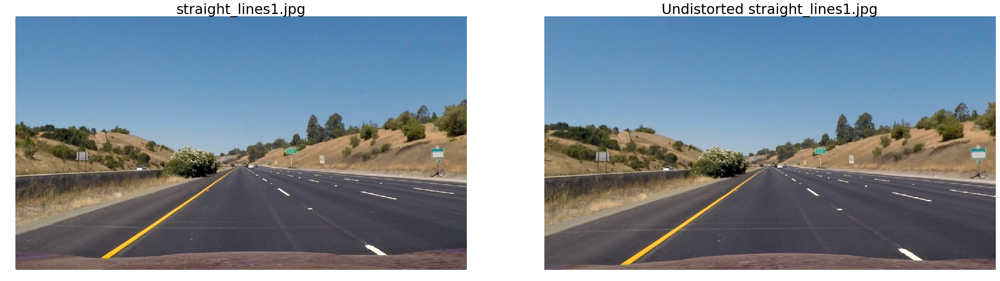
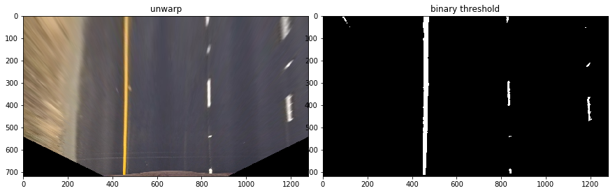
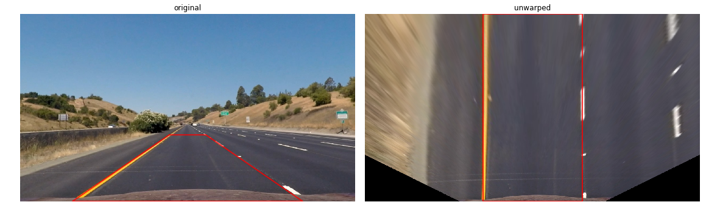
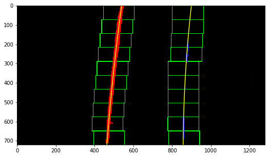
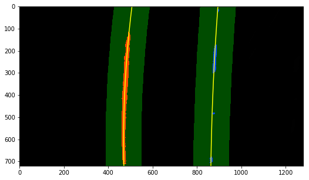
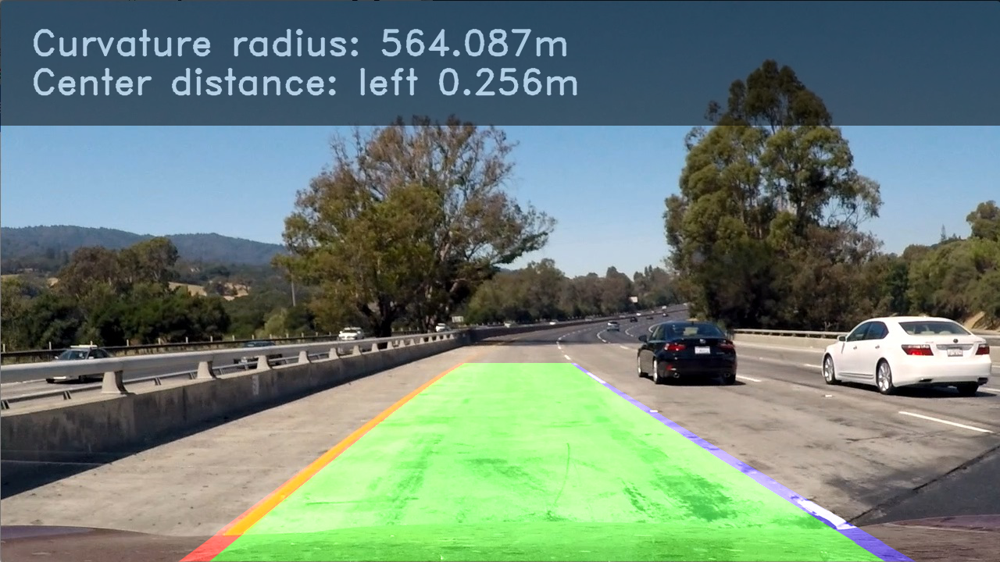

## Writeup

---

**Advanced Lane Finding Project**

The goals / steps of this project are the following:

* Compute the camera calibration matrix and distortion coefficients given a set of chessboard images.
* Apply a distortion correction to raw images.
* Use color transforms, gradients, etc., to create a thresholded binary image.
* Apply a perspective transform to rectify binary image ("birds-eye view").
* Detect lane pixels and fit to find the lane boundary.
* Determine the curvature of the lane and vehicle position with respect to center.
* Warp the detected lane boundaries back onto the original image.
* Output visual display of the lane boundaries and numerical estimation of lane curvature and vehicle position.

[//]: # (Image References)

[image3]: 
[image4]: 


## [Rubric](https://review.udacity.com/#!/rubrics/571/view) Points

### Here I will consider the rubric points individually and describe how I addressed each point in my implementation.  

---

### Writeup / README

#### 1. Provide a Writeup / README that includes all the rubric points and how you addressed each one.  You can submit your writeup as markdown or pdf.  [Here](https://github.com/udacity/CarND-Advanced-Lane-Lines/blob/master/writeup_template.md) is a template writeup for this project you can use as a guide and a starting point.  

README.md is the writeup file (you are reading it!)
If not specifically mentioned, all code refers to file `adv_lane_line.ipynb`.

### Camera Calibration

#### 1. Briefly state how you computed the camera matrix and distortion coefficients. Provide an example of a distortion corrected calibration image.

The code for this step is in , of the section *Compute camera calibration matrix and distortion coefficients from chessboard images*.

I use the provided images in folder `camera_cal/` to compute camera matrix and get distortion coefficients. Since the provided images are chessboards from different view angle, Assume all corners in 3-D space are on the same plane z=0, with coordinate like (x, y, 0), and are stored in `objpoints`. Each corner have a corresponding 2-D coordinates (x', y') on the image, and can be detected by using `findChessboardCorners()` and then stored in `imgpoints`. Corners in `objpoints` and `imgpoints` can be related by using OpenCV `drawChessboardCorners()` method to get the distortion coefficients.

Once we have ditortion coefficients, I use OpenCV `undistort()` method to correct the distortion:

camera_cal/calibration1.jpg
* Calibration


### Pipeline (single images)

#### 1. Provide an example of a distortion-corrected image.

Undistorted images are in folder `undist_images/`. Here is an example for testing images:

* Undistorted



#### 2. Describe how (and identify where in your code) you used color transforms, gradients or other methods to create a thresholded binary image.  Provide an example of a binary image result.

**NOTE: I do perspective transform (unwarp) before creating thresholded binary image because bird-view image gives me better observation and visualization.**

I only use color threshol to produce binary image, the code is in section *Use color transforms, gradients, etc., to create a thresholded binary image*. I use HLS color space L-channel (light) to extract white lane, and Lab color space b-channel to extract yellow lane. 

I have tried other color spaces, like RGB and HSV. I also try different combination of using gradients, like sobel on x, sobel on y, sobel on x-y weighting, sobel on direction. However, sobel seems perfome worse than simple color thresholding, at least in testing images because it will discard many pixels and cause the later polyfit not stable. You can take a look `color_experiment.ipynb` for the experiment outcomes.

* Binary threshold


#### 3. Describe how (and identify where in your code) you performed a perspective transform and provide an example of a transformed image.

The code is in section *Apply a perspective transform to get birds-eye view*, I use `getPerspectiveTransform()` to get the conversion matrix from `src` region to `dst` region, and then apply the conversion matrix to `warpPerspective()` to get the unwarped image. 

The `src` is a Trapezoid polygon with four points, and `dst` is a rectangle where the corresponding points mapped to:


```python
SRC_REGION = np.float32(
    [(570, 465),   # top-left
     (200, 720),   # bottom-left
     (710, 465),   # top-right
     (1080, 720),  # bottom-right
    ])
OFFSET = 450
H, W = 720, 1280
DST_REGION = np.float32([
    (OFFSET, 0),
    (OFFSET, H),
    (W - OFFSET, 0),
    (W - OFFSET, H)])
```

This resulted in the following source and destination points:

| Source        | Destination   | 
|:-------------:|:-------------:| 
| 570, 465      | 450, 0        | 
| 200, 720      | 450, 720      |
| 710, 465      | 830, 0        |
| 1080, 7200    | 830, 720      |

I verified that my perspective transform was working as expected by drawing the `src` and `dst` points onto a test image and its warped counterpart to verify that the lines appear parallel in the warped image.

* Perspective transform


#### 4. Describe how (and identify where in your code) you identified lane-line pixels and fit their positions with a polynomial?

I fit the lane-lines to a 2nd order polynomial in section *Search lanes using previous frame*. There are two methods:

1. `search_lanes`
Search 2nd order polynomal lanes from binary image by using sliding window.


2. `search_lanes_with_prev`
Search lanes from binary image but with previous frame fitting polynomial given. 



#### 5. Describe how (and identify where in your code) you calculated the radius of curvature of the lane and the position of the vehicle with respect to center.

I did this in section *Determine the curvature of the lane and vehicle position with respect to center.*

#### 6. Provide an example image of your result plotted back down onto the road such that the lane area is identified clearly.

I implemented this step in section *Warp the detected lane boundaries back onto the original image*


 
---

### Pipeline (video)

#### 1. Provide a link to your final video output.  Your pipeline should perform reasonably well on the entire project video (wobbly lines are ok but no catastrophic failures that would cause the car to drive off the road!).

Youtube link:
[](http://www.youtube.com/watch?v=LOMVdBbm-uE "Video output")

---

### Discussion

#### 1. Briefly discuss any problems / issues you faced in your implementation of this project.  Where will your pipeline likely fail?  What could you do to make it more robust?

My pipeline do a pretty fine job for `project_video.mp4`. However, it behaves pretty bad for challenged one:

1. Cannot find white lanes when the camera is in high exposure (too bright)

2. It cannot detects huge turn (high curvature) lane well.

For 1. I need to try other color & gradient methods to see whether white lanes can still be extracted even in high exposure. Maybe a comination in multiple color spaces with adpative sobel kernal might work, but this requires more research.

For 2. Since I only use the most basic sliding window search, maybe we can use adpative window width / margin based on curvature. If curvature is high (sharp turn), we use wider window.